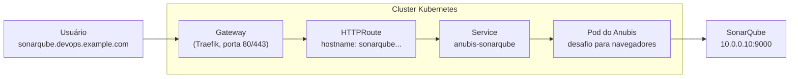
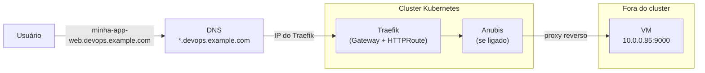
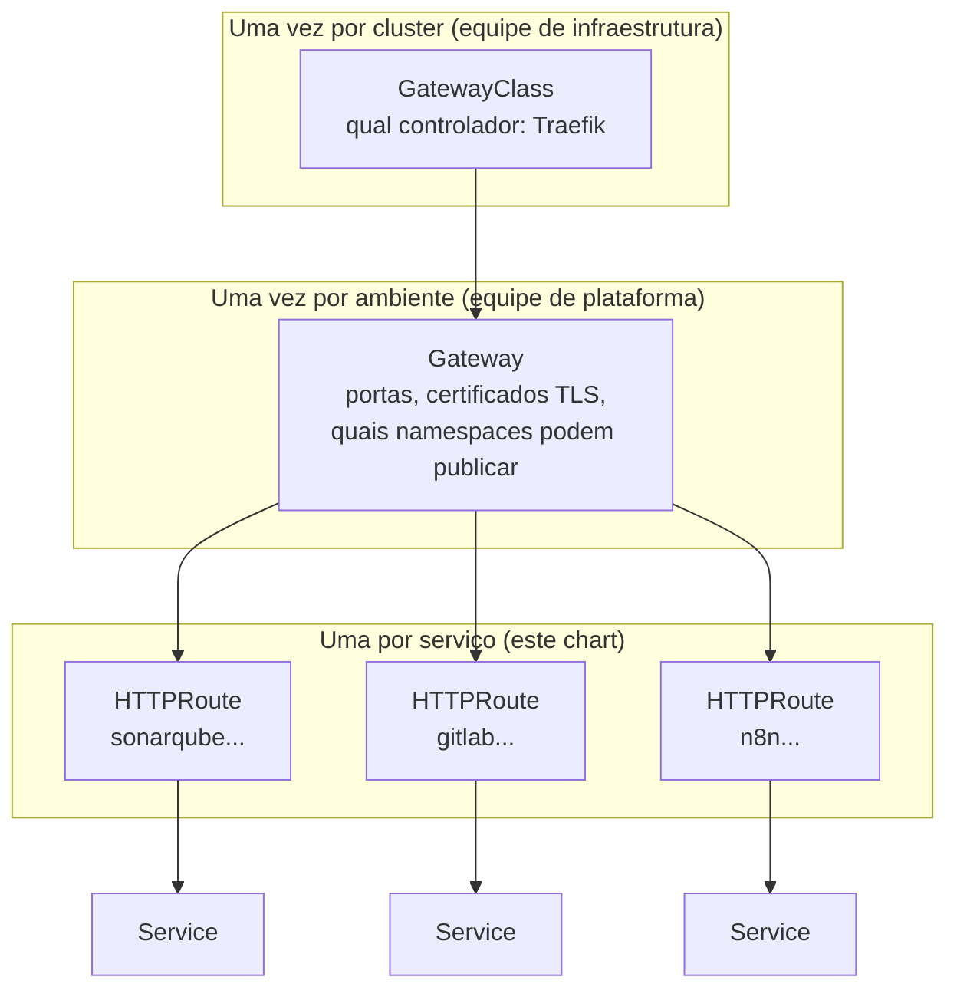
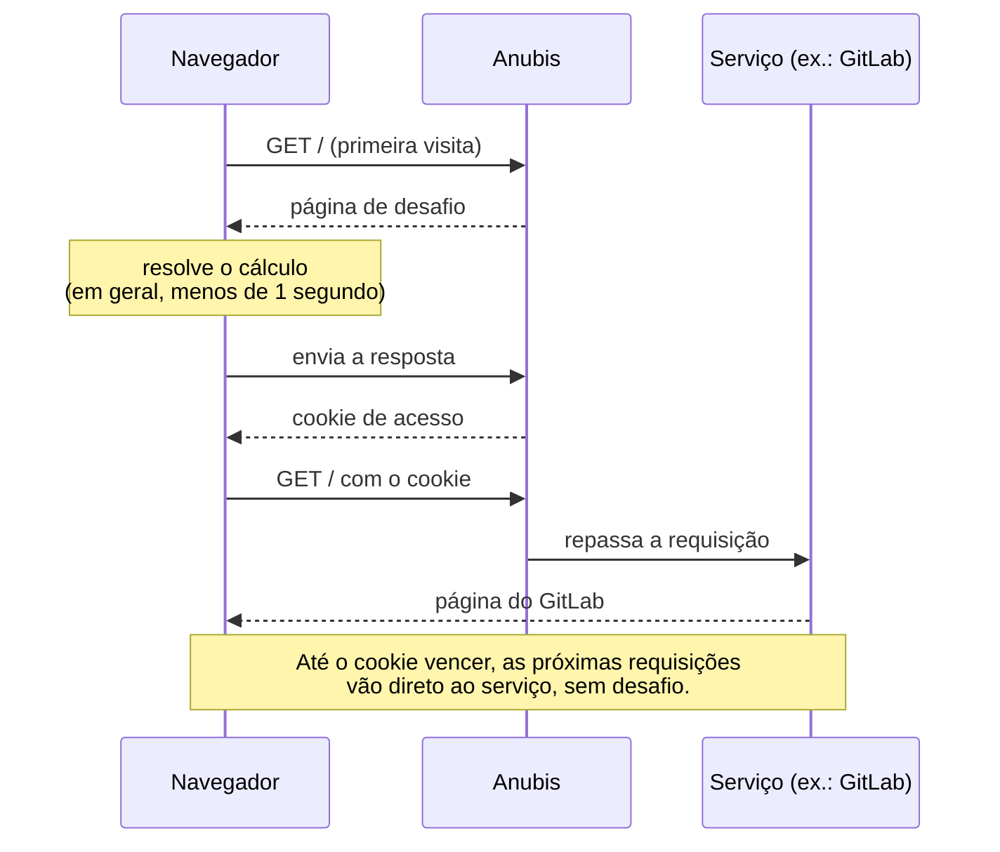

# Gateway Route Factory

English version: [README.md](README.md)

Chart Helm (`anubis-gateway`) que publica serviços pelo Traefik usando a Gateway API, com a opção de colocar o [Anubis](https://anubis.techaro.lol) na frente de cada serviço para barrar bots.

O objetivo é centralizar a publicação. Em vez de cada projeto escrever e manter os próprios manifests de rota, todos os serviços ficam numa lista só, no `values.yaml` deste chart. Publicar um serviço novo é acrescentar um item nessa lista e rodar `helm upgrade`.

## Por que centralizar

Sem este chart, cada projeto que quer um endereço público precisa escrever a própria rota, o Service para alcançar o backend, a NetworkPolicy e, se quiser proteção contra bots, o Deployment do Anubis com a configuração dele. São quatro ou cinco arquivos por projeto, copiados de um projeto para o outro, e cada cópia vai divergindo com o tempo.

Com o chart, o mesmo serviço vira isto:

```yaml
endpoints:
  - name: "sonarqube"
    hostname: "sonarqube.devops.example.com"
    externalIp: "10.0.0.10"
    port: 9000
```

A partir dessas quatro linhas o chart cria tudo o que o serviço precisa, sempre do mesmo jeito. Uma correção feita no chart vale para todos os serviços no próximo `helm upgrade`, e a lista no `values.yaml` mostra num lugar só tudo o que está publicado.

## Como uma requisição chega ao serviço



1. O DNS de `sonarqube.devops.example.com` aponta para o Traefik.
2. O Gateway recebe a requisição e procura a HTTPRoute cujo `hostname` bate com o endereço pedido.
3. A HTTPRoute entrega a requisição ao Service do Anubis.
4. O Anubis decide se o cliente precisa resolver o desafio. Se não precisar, ou depois que ele resolver, a requisição segue para o SonarQube.

Com o Anubis desligado para um serviço, os passos 3 e 4 viram um só: a HTTPRoute entrega direto ao Service do próprio serviço.

## DNS wildcard: publicar sem pedir DNS

O ideal é criar uma única entrada de DNS wildcard apontando para o Traefik do cluster:

```
*.devops.example.com    A    <IP do Traefik>
```

Com ela, qualquer nome terminado em `.devops.example.com` já chega ao Traefik, e é a HTTPRoute que decide para onde cada nome vai. Publicar um serviço novo deixa de exigir um pedido de DNS: basta acrescentar o item em `endpoints`.

### Proxy reverso para VMs fora do cluster

O serviço publicado não precisa estar no Kubernetes. Uma aplicação que roda numa VM fora do cluster, num servidor físico ou em qualquer máquina da rede é publicada do mesmo jeito, só com o IP e a porta. Por exemplo, uma aplicação web numa VM em `10.0.0.85:9000`:

```yaml
endpoints:
  - name: "minha-app-web"
    hostname: "minha-app-web.devops.example.com"
    externalIp: "10.0.0.85"
    port: 9000
```

Depois do `helm upgrade`, o cluster passa a funcionar como proxy reverso para essa VM. Quem acessa `minha-app-web.devops.example.com` recebe a resposta da aplicação em `10.0.0.85:9000` sem saber o IP nem a porta dela. A VM não precisa ficar exposta para os usuários, e nela não se instala nada: nenhum agente, nenhuma configuração nova.



Quem abre a conexão com a VM é o Pod do Anubis ou, com o Anubis desligado, o próprio Traefik. Para funcionar, a rede precisa deixar o cluster chegar até a VM:

- os nós do cluster precisam ter rota até o IP da VM;
- o firewall da VM, e qualquer firewall no caminho, precisa aceitar conexões vindas dos nós do cluster na porta do serviço (`9000` no exemplo);
- dentro do cluster, a NetworkPolicy que o chart cria para o Anubis já libera a saída só para esse IP e essa porta.

Para testar a partir do cluster antes de publicar:

```bash
kubectl run teste-vm --rm -it --restart=Never --image=curlimages/curl:8.10.1 -- \
  curl -sS -o /dev/null -w "%{http_code}\n" http://10.0.0.85:9000/
```

Se o comando responder um código HTTP (200, 302, 401...), o cluster alcança a VM. Se der timeout, o problema está na rota ou no firewall, e não no chart.

O wildcard também simplifica o HTTPS: um único certificado para `*.devops.example.com`, configurado no listener do Gateway, cobre todos os serviços publicados.

## Por que Gateway API e não Ingress

O Kubernetes tem duas formas de publicar serviços HTTP: o `Ingress`, mais antigo, e a Gateway API, que o substitui. Este chart usa a Gateway API.

### O modelo do Ingress

No Ingress, um único recurso mistura duas coisas: a infraestrutura (qual controlador, qual certificado TLS) e o roteamento da aplicação (qual host vai para qual Service). O que o recurso padrão não cobre, como redirecionamento, reescrita de caminho ou divisão de tráfego, vira anotação específica de cada controlador:

```yaml
apiVersion: networking.k8s.io/v1
kind: Ingress
metadata:
  name: sonarqube
  annotations:
    # Só o Traefik entende esta anotação. Trocar de controlador exige reescrever.
    traefik.ingress.kubernetes.io/router.entrypoints: websecure
spec:
  ingressClassName: traefik
  tls:
    - hosts: [sonarqube.devops.example.com]
      secretName: sonarqube-tls
  rules:
    - host: sonarqube.devops.example.com
      http:
        paths:
          - path: /
            pathType: Prefix
            backend:
              service:
                name: sonarqube
                port:
                  number: 9000
```

### O modelo da Gateway API

A Gateway API separa as mesmas informações em camadas, e cada camada tem um dono:



- `GatewayClass` diz qual controlador atende os Gateways. É criada uma vez, na instalação do Traefik.
- `Gateway` é o ponto de entrada: em quais portas escuta, com quais certificados e de quais namespaces aceita rotas. Também é criado uma vez.
- `HTTPRoute` é a regra de cada serviço: este hostname, este caminho, este destino. É o que este chart gera.
- `Service` é o destino final, como no Ingress.

Na prática, o roteamento do SonarQube fica assim. A HTTPRoute não fala de TLS nem de portas, porque isso é assunto do Gateway:

```yaml
apiVersion: gateway.networking.k8s.io/v1
kind: HTTPRoute
metadata:
  name: sonarqube-service-route
spec:
  parentRefs:
    - name: traefik              # o Gateway onde esta rota se pendura
      namespace: global-gateway
  hostnames:
    - sonarqube.devops.example.com
  rules:
    - matches:
        - path: { type: PathPrefix, value: / }
      backendRefs:
        - name: sonarqube
          port: 9000
```

### O que se ganha com a troca

Cada equipe mexe só na sua parte. Quem publica um serviço escreve uma HTTPRoute e não tem como alterar, por engano, os certificados ou as portas do Gateway, que ficam em outro recurso.

Redirecionamento, reescrita de caminho, roteamento por header e divisão de tráfego por peso (para um canary, por exemplo) são campos padrão da HTTPRoute, e não anotações de um controlador. O mesmo YAML funciona em qualquer controlador compatível: trocar o Traefik por outro muda a GatewayClass, e as rotas continuam iguais.

Rotas entre namespaces passam a ser possíveis, com controle. Um Ingress só aponta para Services do próprio namespace. Uma HTTPRoute pode apontar para um Service de outro namespace, desde que esse namespace autorize com uma `ReferenceGrant`.

Por fim, a Gateway API é o caminho que o próprio Kubernetes escolheu. A documentação oficial diz que a API do Ingress está congelada e não vai receber novos recursos, e o ingress-nginx, o controlador de Ingress mais usado, foi aposentado pela comunidade Kubernetes, com a manutenção encerrada em março de 2026.

## Por que o Anubis

Serviços web publicados na internet recebem, além das pessoas, uma quantidade grande de robôs: crawlers que coletam conteúdo para treinar IA, scrapers e scanners. Serviços como GitLab e SonarQube sofrem mais, porque cada página é cara de gerar e um robô pede milhares delas por minuto. O resultado é lentidão ou queda para quem usa o serviço de verdade.

O Anubis fica entre o Traefik e o serviço e pede ao navegador que resolva um pequeno cálculo (uma prova de trabalho) antes de liberar o acesso. Para uma pessoa isso costuma levar menos de um segundo e acontece uma vez só: depois de resolvido, o navegador recebe um cookie e passa direto até o cookie vencer. Para um robô que abre milhares de conexões, repetir o cálculo em cada uma sai caro demais.



O desafio só aparece para quem se identifica como navegador. `curl`, `git`, o cliente do Docker, probes e a maioria das ferramentas de linha de comando passam direto pelas regras padrão do Anubis. Por isso ele pode ficar na frente de um GitLab sem atrapalhar `git clone` nem pipelines.

### Quando desligar o Anubis

O desafio depende de JavaScript no navegador. Desligue o Anubis nos serviços em que isso atrapalha:

| Serviço | Anubis? | Motivo |
|---|---|---|
| GitLab, SonarQube, sites e painéis usados por pessoas | Ligado | É onde os robôs causam mais estrago |
| API chamada só por outros sistemas | Desligado | Não há navegador para resolver o desafio, e o Anubis só adicionaria um salto a mais |
| Webhooks recebidos de fora | Desligado | Quem chama é um sistema, não uma pessoa |
| Serviço acessado só pela rede interna | Opcional | Se não há robôs de fora, não há o que barrar |

## Ligando e desligando o Anubis

`anubisDefaults.enabled` define o padrão para todos os endpoints, e cada endpoint pode sobrescrever com `anubis: true` ou `anubis: false`:

```yaml
anubisDefaults:
  enabled: true              # Anubis ligado para todos, por padrão

endpoints:
  # Usa o padrão: com Anubis
  - name: "gitlab"
    hostname: "gitlab.devops.example.com"
    externalIp: "10.0.0.20"
    port: 80

  # Exceção: publicado sem Anubis
  - name: "api-interna"
    hostname: "api.devops.example.com"
    externalIp: "10.0.0.40"
    port: 8080
    anubis: false
```

O que o chart cria em cada caso:

| | Com Anubis | Sem Anubis |
|---|---|---|
| `HTTPRoute` | Aponta para o Service do Anubis | Aponta direto para o serviço |
| `Deployment`, `Service`, `ConfigMap` e `NetworkPolicy` do Anubis | Criados | Não criados |
| Serviço por IP (`externalIp`) | O Anubis fala direto com o IP | O chart cria um `Service` com `EndpointSlice` apontando para o IP, porque uma HTTPRoute só aponta para Services |
| Serviço do cluster (`target`) em outro namespace | O Anubis fala direto com o Service | O chart cria uma `ReferenceGrant` no namespace do serviço, autorizando a rota a apontar para ele |

Sem o Anubis, `target` precisa ser um Service do cluster no formato `http://<service>.<namespace>.svc.cluster.local:<porta>`. Qualquer outra URL faz o `helm upgrade` parar com uma mensagem explicando o formato.

## Pré-requisitos

- Traefik instalado com o provider de Gateway API, com a GatewayClass e o Gateway já criados. O nome e o namespace do Gateway vão em `gateway.name` e `gateway.namespace`. Se as rotas ficarem num namespace diferente do Gateway, o listener precisa aceitar rotas desse namespace (`allowedRoutes`).
- O Traefik precisa repassar o header `X-Real-IP`, o que ele faz por padrão. Sem esse header o Anubis responde com erro em vez do desafio.
- Recomendado: uma entrada de DNS wildcard (`*.devops.example.com`) apontando para o Traefik, como explicado em "DNS wildcard: publicar sem pedir DNS". Sem ela, cada `hostname` novo precisa de uma entrada de DNS própria.

Os recursos são criados no namespace de `namespaceOverride` (padrão `global-gateway`), mesmo que o `helm` receba outro com `-n`.

## Uso

### 1. Criar o namespace e a chave do Anubis (uma vez só)

A chave Ed25519 assina os cookies de desafio resolvido. Todos os endpoints usam a mesma Secret. Se nenhum endpoint usar o Anubis, este passo pode ser pulado.

```bash
kubectl create namespace global-gateway

# Gerar a chave de 32 bytes (64 caracteres hex)
openssl rand -hex 32

# Criar a Secret no Kubernetes
kubectl create secret generic anubis-key \
  -n global-gateway \
  --from-literal=private-key="<SUA_CHAVE_HEX_GERADA>"
```

### 2. Listar os serviços em `values.yaml`

```yaml
namespaceOverride: "global-gateway"

gateway:
  name: "traefik"
  namespace: "global-gateway"

endpoints:
  # Serviço fora do cluster (IP e porta)
  - name: "rag"
    hostname: "rag.devops.example.com"
    externalIp: "10.0.0.30"
    port: 3000

  # Serviço dentro do cluster (URL do Service)
  - name: "argocd"
    hostname: "argocd.devops.example.com"
    target: "http://argocd-server.argocd.svc.cluster.local:80"
```

#### Como montar o `target`

O `target` é o endereço interno do Service no cluster, e segue sempre o mesmo formato:

```
http://<nome-do-service>.<namespace>.svc.cluster.local:<porta>
```

Desmontando o exemplo do ArgoCD:

```
http://argocd-server.argocd.svc.cluster.local:80
       └─────┬─────┘ └─┬──┘ └───────┬───────┘ └┬┘
             │         │            │          └── porta do Service
             │         │            └── sufixo fixo, igual para todo Service
             │         └── namespace onde o Service está
             └── nome do Service
```

Outro exemplo: uma API chamada `minha-api`, no namespace `financeiro`, com o Service na porta `8080`:

```yaml
endpoints:
  - name: "minha-api"
    hostname: "minha-api.devops.example.com"
    #        http://<nome-do-service>.<namespace>.svc.cluster.local:<porta>
    target: "http://minha-api.financeiro.svc.cluster.local:8080"
```

Para descobrir o nome, o namespace e a porta de um Service, liste os Services do cluster. As colunas `NAMESPACE`, `NAME` e `PORT(S)` dão as três partes do `target`:

```bash
kubectl get svc -A
# NAMESPACE    NAME            TYPE        CLUSTER-IP     PORT(S)
# argocd       argocd-server   ClusterIP   10.96.12.34    80/TCP,443/TCP
# financeiro   minha-api       ClusterIP   10.96.56.78    8080/TCP
```

A porta é a do Service (a primeira em `PORT(S)`), não a do container. Se o Service tiver mais de uma porta, use a que responde HTTP.

### 3. Instalar ou atualizar

De dentro da pasta do chart:

```bash
helm upgrade --install anubis-gateway . \
  -n global-gateway \
  -f values.yaml
```

O script `create-dns-entry.sh` roda esse mesmo comando e depois mostra os Pods e as rotas. O nome é antigo: ele não cria entrada de DNS. Com o DNS wildcard, nenhuma entrada nova é necessária; sem ele, a entrada de cada hostname é criada fora do chart. O primeiro argumento é o namespace do release (padrão `global-gateway`):

```bash
./create-dns-entry.sh
```

Para publicar um serviço novo, acrescente um item em `endpoints` e rode o `helm upgrade` de novo.

## Uma réplica por serviço

Cada serviço com Anubis roda com exatamente um Pod do Anubis, e o chart não tem opção de réplicas. Sem um storage compartilhado, o Anubis guarda os desafios em memória. Com duas réplicas, um desafio emitido por um Pod e respondido para o outro falha, e o usuário vê erros intermitentes.

Quando o Pod reinicia, os desafios em andamento se perdem e quem estava no meio de um precisa resolver de novo. Os cookies de quem já passou continuam valendo, porque são assinados pela chave da Secret, que não muda.

Para ter mais de uma réplica, é preciso configurar o Anubis com um storage compartilhado (Valkey/Redis), o que este chart ainda não faz.

## Caminhos liberados sem desafio

`bypassPaths` lista caminhos que passam direto, sem desafio, como health checks e métricas. O padrão é `/health,/ready,/metrics`. Cada caminho libera ele mesmo e tudo abaixo dele (`/health` libera `/health/db`, mas não `/healthz`).

O chart transforma essa lista numa regra `ALLOW` no policy file do Anubis e importa, logo depois, as regras padrão do próprio Anubis. Como clientes que não se identificam como navegador já passam direto, o `bypassPaths` serve para quando um navegador, ou algo que se identifica como um, precisa acessar esses caminhos sem desafio.

## Configuração por endpoint

Cada item de `endpoints` pode substituir alguns valores de `anubisDefaults`:

```yaml
endpoints:
  - name: "app-especial"
    hostname: "app-especial.devops.example.com"
    externalIp: "10.0.0.50"
    port: 8080
    anubis: true                       # sobrescreve anubisDefaults.enabled
    path: "/"                          # prefixo de caminho da rota (padrão "/")
    cookieExpirationTime: "2h"         # validade do cookie de desafio resolvido (padrão 30m)
    logLevel: "debug"                  # padrão info
    bypassPaths: "/health,/docs"       # substitui a lista padrão
    cookieDomain: "devops.example.com" # domínio do cookie (padrão: só o próprio hostname)
    resources:
      limits:
        cpu: 500m
        memory: 512Mi
```

Mudar o `bypassPaths` de um endpoint reinicia só o Pod daquele endpoint, para ele carregar o policy file novo.
