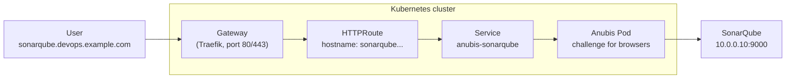
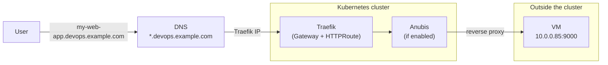
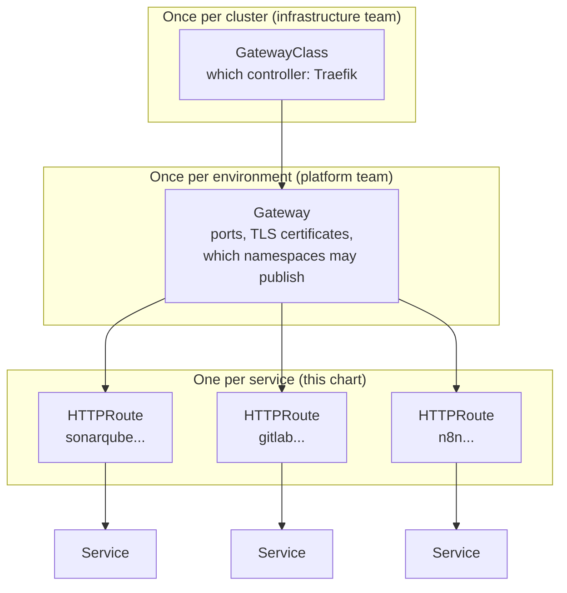
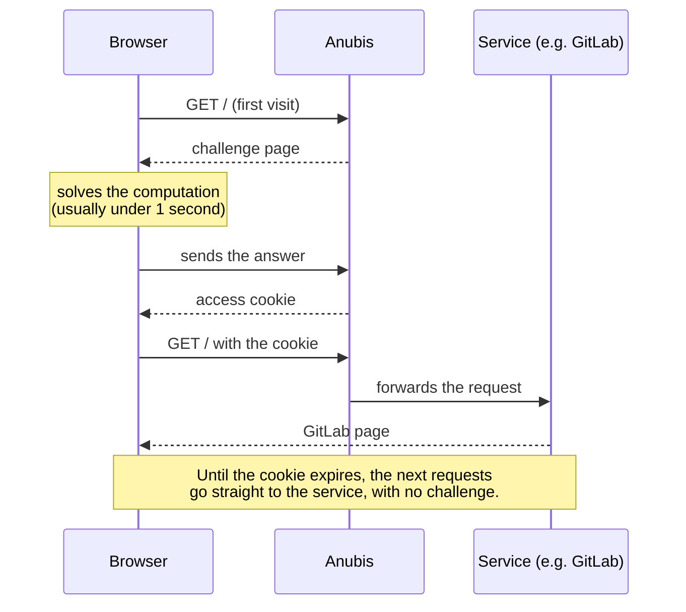

# Gateway Route Factory

Versão em pt-BR: [README-PT-br.md](README-PT-br.md)

Helm chart (`anubis-gateway`) that publishes services through Traefik using the Gateway API, with the option of putting [Anubis](https://anubis.techaro.lol) in front of each service to keep bots out.

The goal is to centralize publishing. Instead of every project writing and maintaining its own route manifests, all services live in a single list in this chart's `values.yaml`. Publishing a new service means adding an item to that list and running `helm upgrade`.

## Why centralize

Without this chart, every project that wants a public address has to write its own route, a Service to reach the backend, a NetworkPolicy and, if it wants bot protection, an Anubis Deployment with its configuration. That is four or five files per project, copied from one project to the next, and each copy drifts over time.

With the chart, the same service becomes this:

```yaml
endpoints:
  - name: "sonarqube"
    hostname: "sonarqube.devops.example.com"
    externalIp: "10.0.0.10"
    port: 9000
```

From these four lines the chart creates everything the service needs, always the same way. A fix made in the chart reaches every service on the next `helm upgrade`, and the list in `values.yaml` shows in one place everything that is published.

## How a request reaches the service



1. The DNS name `sonarqube.devops.example.com` points to Traefik.
2. The Gateway receives the request and looks for the HTTPRoute whose `hostname` matches the requested address.
3. The HTTPRoute hands the request to the Anubis Service.
4. Anubis decides whether the client has to solve the challenge. If it doesn't, or once it has, the request goes on to SonarQube.

With Anubis turned off for a service, steps 3 and 4 become one: the HTTPRoute sends the request straight to the service's own Service.

## Wildcard DNS: publish without asking for DNS

Ideally, create a single wildcard DNS record pointing to the cluster's Traefik:

```
*.devops.example.com    A    <Traefik IP>
```

With it, any name ending in `.devops.example.com` already reaches Traefik, and the HTTPRoute decides where each name goes. Publishing a new service no longer needs a DNS request: adding the item to `endpoints` is enough.

### Reverse proxy for VMs outside the cluster

The published service doesn't have to run on Kubernetes. An application on a VM outside the cluster, on a physical server or on any machine on the network is published the same way, with just its IP and port. For example, a web application on a VM at `10.0.0.85:9000`:

```yaml
endpoints:
  - name: "my-web-app"
    hostname: "my-web-app.devops.example.com"
    externalIp: "10.0.0.85"
    port: 9000
```

After `helm upgrade`, the cluster acts as a reverse proxy for that VM. Whoever opens `my-web-app.devops.example.com` gets the response from the application at `10.0.0.85:9000` without knowing its IP or port. The VM doesn't have to be exposed to users, and nothing is installed on it: no agent, no new configuration.



The connection to the VM is opened by the Anubis Pod or, with Anubis off, by Traefik itself. For this to work, the network has to let the cluster reach the VM:

- the cluster nodes need a route to the VM's IP;
- the VM's firewall, and any firewall along the way, must accept connections from the cluster nodes on the service port (`9000` in the example);
- inside the cluster, the NetworkPolicy the chart creates for Anubis already allows egress to that IP and port only.

To test from the cluster before publishing:

```bash
kubectl run test-vm --rm -it --restart=Never --image=curlimages/curl:8.10.1 -- \
  curl -sS -o /dev/null -w "%{http_code}\n" http://10.0.0.85:9000/
```

If the command prints an HTTP status code (200, 302, 401...), the cluster can reach the VM. If it times out, the problem is in the routing or the firewall, not in the chart.

The wildcard also makes HTTPS simpler: a single certificate for `*.devops.example.com`, configured on the Gateway listener, covers every published service.

## Why the Gateway API and not Ingress

Kubernetes has two ways to publish HTTP services: `Ingress`, the older one, and the Gateway API, which replaces it. This chart uses the Gateway API.

### The Ingress model

In Ingress, a single resource mixes two things: infrastructure (which controller, which TLS certificate) and application routing (which host goes to which Service). Anything the standard resource doesn't cover, such as redirects, path rewrites or traffic splitting, becomes a controller-specific annotation:

```yaml
apiVersion: networking.k8s.io/v1
kind: Ingress
metadata:
  name: sonarqube
  annotations:
    # Only Traefik understands this annotation. Switching controllers means rewriting it.
    traefik.ingress.kubernetes.io/router.entrypoints: websecure
spec:
  ingressClassName: traefik
  tls:
    - hosts: [sonarqube.devops.example.com]
      secretName: sonarqube-tls
  rules:
    - host: sonarqube.devops.example.com
      http:
        paths:
          - path: /
            pathType: Prefix
            backend:
              service:
                name: sonarqube
                port:
                  number: 9000
```

### The Gateway API model

The Gateway API splits the same information into layers, and each layer has an owner:



- `GatewayClass` says which controller serves the Gateways. It is created once, when Traefik is installed.
- `Gateway` is the entry point: which ports it listens on, with which certificates, and which namespaces it accepts routes from. It is also created once.
- `HTTPRoute` is the rule for each service: this hostname, this path, this destination. This is what the chart generates.
- `Service` is the final destination, as with Ingress.

In practice, SonarQube's routing looks like this. The HTTPRoute says nothing about TLS or ports, because that belongs to the Gateway:

```yaml
apiVersion: gateway.networking.k8s.io/v1
kind: HTTPRoute
metadata:
  name: sonarqube-service-route
spec:
  parentRefs:
    - name: traefik              # the Gateway this route attaches to
      namespace: global-gateway
  hostnames:
    - sonarqube.devops.example.com
  rules:
    - matches:
        - path: { type: PathPrefix, value: / }
      backendRefs:
        - name: sonarqube
          port: 9000
```

### What you gain from the switch

Each team touches only its own part. Whoever publishes a service writes an HTTPRoute and has no way to change, by mistake, the Gateway's certificates or ports, which live in a different resource.

Redirects, path rewrites, header-based routing and weighted traffic splitting (for a canary, for example) are standard HTTPRoute fields, not controller annotations. The same YAML works on any conformant controller: replacing Traefik with another one changes the GatewayClass, and the routes stay the same.

Cross-namespace routing becomes possible, with control. An Ingress can only point to Services in its own namespace. An HTTPRoute can point to a Service in another namespace, as long as that namespace allows it with a `ReferenceGrant`.

Finally, the Gateway API is the direction Kubernetes itself chose. The official documentation says the Ingress API is frozen and will not get new features, and ingress-nginx, the most widely used Ingress controller, was retired by the Kubernetes community, with maintenance ending in March 2026.

## Why Anubis

Web services published on the internet get, besides people, a large volume of robots: crawlers that collect content to train AI, scrapers and scanners. Services like GitLab and SonarQube suffer the most, because every page is expensive to render and a robot asks for thousands of them per minute. The result is slowness or downtime for the people who actually use the service.

Anubis sits between Traefik and the service and asks the browser to solve a small computation (a proof of work) before granting access. For a person this usually takes less than a second and happens only once: after solving it, the browser gets a cookie and goes straight through until the cookie expires. For a robot opening thousands of connections, repeating the computation on each one is too expensive.



The challenge only shows up for clients that identify themselves as browsers. `curl`, `git`, the Docker client, probes and most command-line tools go straight through Anubis's default rules. That is why it can sit in front of GitLab without getting in the way of `git clone` or pipelines.

### When to turn Anubis off

The challenge relies on JavaScript in the browser. Turn Anubis off for the services where that gets in the way:

| Service | Anubis? | Reason |
|---|---|---|
| GitLab, SonarQube, sites and dashboards used by people | On | This is where robots do the most damage |
| API called only by other systems | Off | There is no browser to solve the challenge, and Anubis would only add an extra hop |
| Webhooks received from outside | Off | The caller is a system, not a person |
| Service reached only from the internal network | Optional | With no outside robots, there is nothing to block |

## Turning Anubis on and off

`anubisDefaults.enabled` sets the default for every endpoint, and each endpoint can override it with `anubis: true` or `anubis: false`:

```yaml
anubisDefaults:
  enabled: true              # Anubis on for everyone by default

endpoints:
  # Uses the default: with Anubis
  - name: "gitlab"
    hostname: "gitlab.devops.example.com"
    externalIp: "10.0.0.20"
    port: 80

  # Exception: published without Anubis
  - name: "internal-api"
    hostname: "api.devops.example.com"
    externalIp: "10.0.0.40"
    port: 8080
    anubis: false
```

What the chart creates in each case:

| | With Anubis | Without Anubis |
|---|---|---|
| `HTTPRoute` | Points to the Anubis Service | Points straight to the service |
| Anubis `Deployment`, `Service`, `ConfigMap` and `NetworkPolicy` | Created | Not created |
| Service by IP (`externalIp`) | Anubis talks to the IP directly | The chart creates a `Service` with an `EndpointSlice` pointing to the IP, because an HTTPRoute can only point to Services |
| Cluster service (`target`) in another namespace | Anubis talks to the Service directly | The chart creates a `ReferenceGrant` in the service's namespace, allowing the route to point to it |

Without Anubis, `target` must be a cluster Service in the form `http://<service>.<namespace>.svc.cluster.local:<port>`. Any other URL makes `helm upgrade` stop with a message explaining the format.

## Prerequisites

- Traefik installed with the Gateway API provider, with the GatewayClass and the Gateway already created. The Gateway's name and namespace go in `gateway.name` and `gateway.namespace`. If the routes live in a different namespace from the Gateway, the listener must accept routes from that namespace (`allowedRoutes`).
- Traefik must forward the `X-Real-IP` header, which it does by default. Without that header Anubis answers with an error instead of the challenge.
- Recommended: a wildcard DNS record (`*.devops.example.com`) pointing to Traefik, as explained in "Wildcard DNS: publish without asking for DNS". Without it, each new `hostname` needs its own DNS record.

Resources are created in the `namespaceOverride` namespace (default `global-gateway`), even if `helm` gets a different one with `-n`.

## Usage

### 1. Create the namespace and the Anubis key (once)

The Ed25519 key signs the cookies for solved challenges. All endpoints share the same Secret. If no endpoint uses Anubis, you can skip this step.

```bash
kubectl create namespace global-gateway

# Generate the 32-byte key (64 hex characters)
openssl rand -hex 32

# Create the Secret in Kubernetes
kubectl create secret generic anubis-key \
  -n global-gateway \
  --from-literal=private-key="<YOUR_GENERATED_HEX_KEY>"
```

### 2. List the services in `values.yaml`

```yaml
namespaceOverride: "global-gateway"

gateway:
  name: "traefik"
  namespace: "global-gateway"

endpoints:
  # Service outside the cluster (IP and port)
  - name: "rag"
    hostname: "rag.devops.example.com"
    externalIp: "10.0.0.30"
    port: 3000

  # Service inside the cluster (Service URL)
  - name: "argocd"
    hostname: "argocd.devops.example.com"
    target: "http://argocd-server.argocd.svc.cluster.local:80"
```

#### How to build the `target`

The `target` is the Service's internal address in the cluster, and it always follows the same format:

```
http://<service-name>.<namespace>.svc.cluster.local:<port>
```

Taking the ArgoCD example apart:

```
http://argocd-server.argocd.svc.cluster.local:80
       └─────┬─────┘ └─┬──┘ └───────┬───────┘ └┬┘
             │         │            │          └── Service port
             │         │            └── fixed suffix, the same for every Service
             │         └── namespace the Service lives in
             └── Service name
```

Another example: an API called `my-api`, in the `finance` namespace, with its Service on port `8080`:

```yaml
endpoints:
  - name: "my-api"
    hostname: "my-api.devops.example.com"
    #        http://<service-name>.<namespace>.svc.cluster.local:<port>
    target: "http://my-api.finance.svc.cluster.local:8080"
```

To find a Service's name, namespace and port, list the cluster's Services. The `NAMESPACE`, `NAME` and `PORT(S)` columns give the three parts of the `target`:

```bash
kubectl get svc -A
# NAMESPACE    NAME            TYPE        CLUSTER-IP     PORT(S)
# argocd       argocd-server   ClusterIP   10.96.12.34    80/TCP,443/TCP
# finance      my-api          ClusterIP   10.96.56.78    8080/TCP
```

The port is the Service's (the first one in `PORT(S)`), not the container's. If the Service has more than one port, use the one that serves HTTP.

### 3. Install or upgrade

From the chart folder:

```bash
helm upgrade --install anubis-gateway . \
  -n global-gateway \
  -f values.yaml
```

The `create-dns-entry.sh` script runs this same command and then shows the Pods and routes. The name is old: it does not create a DNS record. With the wildcard DNS no new record is needed; without it, each hostname's record is created outside the chart. The first argument is the release namespace (default `global-gateway`):

```bash
./create-dns-entry.sh
```

To publish a new service, add an item to `endpoints` and run `helm upgrade` again.

## One replica per service

Each service with Anubis runs with exactly one Anubis Pod, and the chart has no replicas option. Without shared storage, Anubis keeps challenges in memory. With two replicas, a challenge issued by one Pod and answered to the other fails, and users see intermittent errors.

When the Pod restarts, challenges in progress are lost, and anyone in the middle of one has to solve it again. Cookies of people who already passed stay valid, because they are signed with the key in the Secret, which doesn't change.

Running more than one replica requires configuring Anubis with shared storage (Valkey/Redis), which this chart doesn't do yet.

## Paths allowed without a challenge

`bypassPaths` lists paths that go straight through, with no challenge, such as health checks and metrics. The default is `/health,/ready,/metrics`. Each path allows itself and everything under it (`/health` allows `/health/db`, but not `/healthz`).

The chart turns this list into an `ALLOW` rule in the Anubis policy file and then imports Anubis's own default rules. Since clients that don't identify as browsers already go straight through, `bypassPaths` is for when a browser, or something that identifies as one, needs to reach these paths without a challenge.

## Per-endpoint configuration

Each item in `endpoints` can override some of the `anubisDefaults` values:

```yaml
endpoints:
  - name: "special-app"
    hostname: "special-app.devops.example.com"
    externalIp: "10.0.0.50"
    port: 8080
    anubis: true                       # overrides anubisDefaults.enabled
    path: "/"                          # route path prefix (default "/")
    cookieExpirationTime: "2h"         # how long a solved-challenge cookie lasts (default 30m)
    logLevel: "debug"                  # default info
    bypassPaths: "/health,/docs"       # replaces the default list
    cookieDomain: "devops.example.com" # cookie domain (default: only the hostname itself)
    resources:
      limits:
        cpu: 500m
        memory: 512Mi
```

Changing an endpoint's `bypassPaths` restarts only that endpoint's Pod, so it loads the new policy file.
